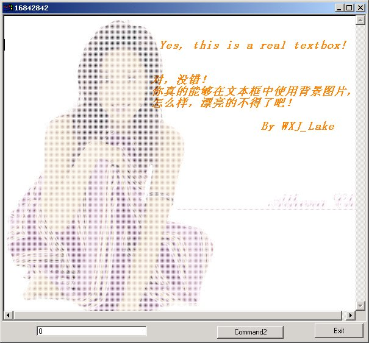



## Owndraw textbox

### Description

Add a background picture to the standard textbox control. Using subclass,and only tested on win2k, maybe not work on win98. i know there is a bit flicker or other bugs, but i think this could be an idea to improve your user interface. Still many things left for you to do, such as wrapping it into a ActiveX control.
 
### More Info
 

             |
---                |---
**Submitted On**   |2001-04-20 00:16:42
**By**             |[WXJ\_Lake](https://github.com/Planet-Source-Code/PSCIndex/blob/master/ByAuthor/wxj-lake.md)
**Level**          |Advanced
**User Rating**    |4.0 (16 globes from 4 users)
**Compatibility**  |VB 4\.0 \(32\-bit\), VB 5\.0, VB 6\.0
**Category**       |[Graphics](https://github.com/Planet-Source-Code/PSCIndex/blob/master/ByCategory/graphics__1-46.md)
**World**          |[Visual Basic](https://github.com/Planet-Source-Code/PSCIndex/blob/master/ByWorld/visual-basic.md)
**Archive File**   |[Owndraw te185944202001\.zip](https://github.com/Planet-Source-Code/wxj-lake-owndraw-textbox__1-22549/archive/master.zip)

